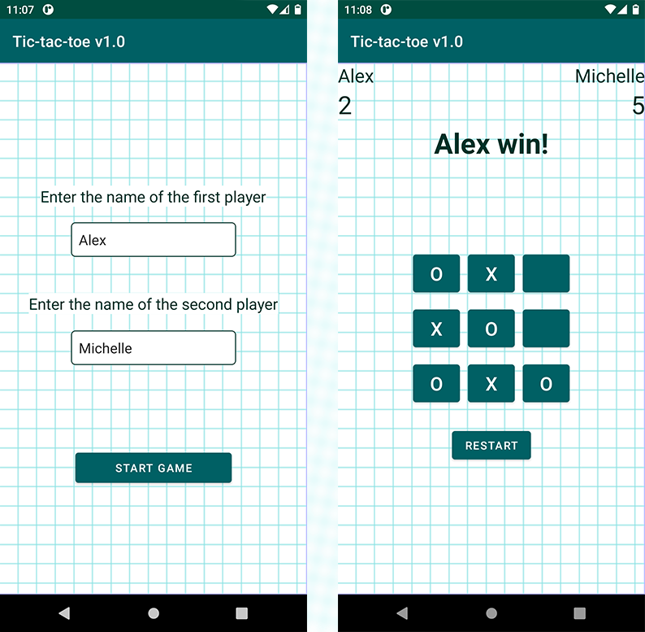

# Android essential #

Completing the practical tasks for the basic course on Android application development by itvdn.com
https://itvdn.com/ru/video/android_essential

* Calculator
* PhoneBook
* Tic-Tac-Toe Game

## Calculator ##

* My first app ever made;
* Written in Java;
* The logic was developed by me independently;
* No copyright images were used for this design.

## PhoneBook ##

Phone book, adding and removing contacts is supported.
Written in Java.

## Tic-Tac-Toe Game ##

Tic-Tac-Toe Game, the logic was developed independently by me.
Written in Java.

